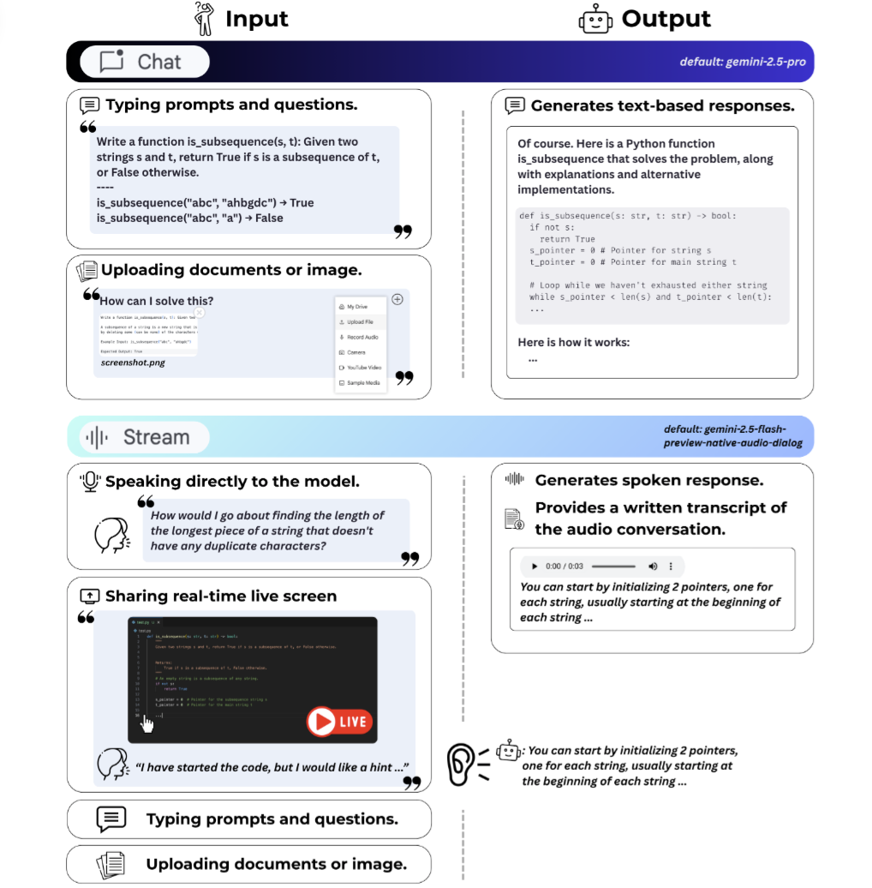
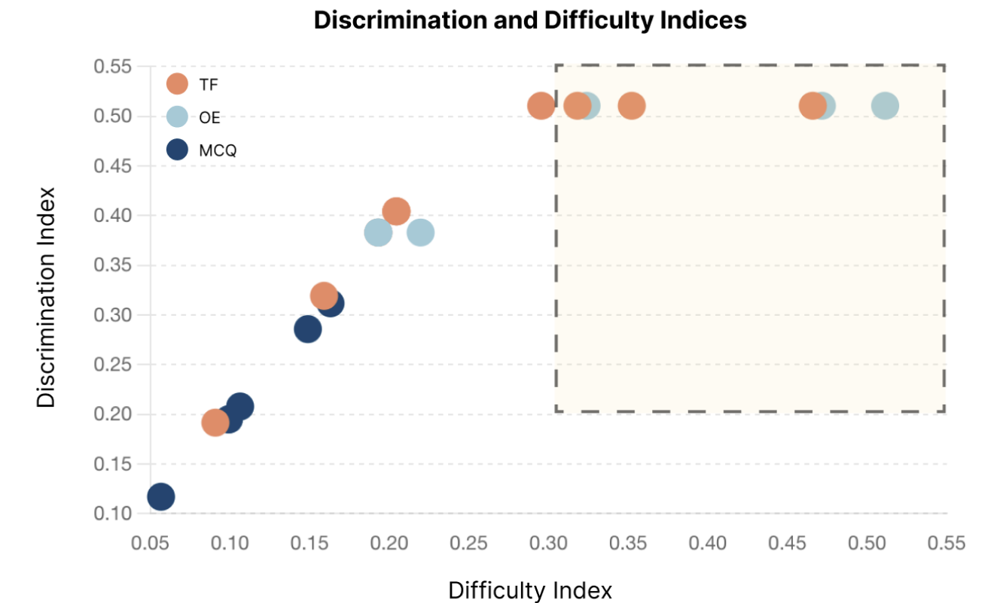
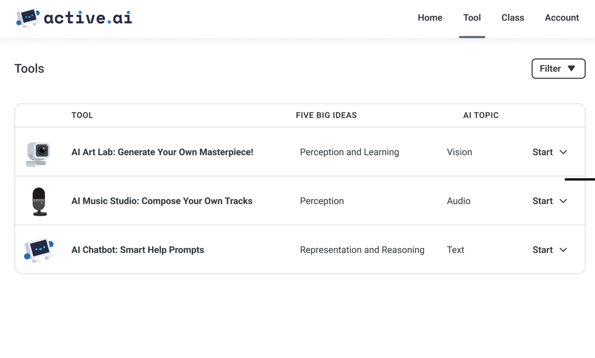

# Hello, I'm Ruiwei! 👋

Welcome to my personal homepage.

Here are some things about me:

- PhD student at CMU
- Research on AI Literacy & Computing Education
- Co-founder of ActiveAI

## Publications

<!-- [C.1] CHI 2026 -->

  

    

      [C.1]CHI 2026
    

    

      Do Teachers Dream of GenAI Widening Educational (In)Equality? Envisioning the Future of K-12 GenAI Education from Global Teachers’ Perspectives.
    

    

      <strong>Ruiwei Xiao</strong>, Qing Xiao, Xinying Hou, Phenyo Phemelo Moletsane, Hanqi Jane Li, Hong Shen, John Stamper
    

    

      Proceedings of the 2026 CHI Conference on Human Factors in Computing Systems (CHI’26). (To appear after revised &amp; resubmitted)
    

    

      <a href="#" target="_blank">+ PDF</a>
      <a href="#" target="_blank">+ Project</a>
      <a href="#" target="_blank">+ BibTeX</a>
    

  

  

    
  

<!-- [C.2] CAEAI 2026 -->

  

    

      [C.2]CAEAI 2026
    

    

      Improving Student-AI Interaction Through Pedagogical Prompting: An Example in Computer Science Education.
    

    

      <strong>Ruiwei Xiao</strong>, Xinying Hou*, Runlong Ye*, Majeed Kazemitabaar*, Nicholas Diana, Michael Liut, John Stamper
    

    

      Computers &amp; Education: Artificial Intelligence (CAEAI’26). (Under review)
    

    

      <a href="https://arxiv.org/abs/2506.19107" target="_blank">+ PDF</a>
      <a href="#" target="_blank">+ Project</a>
      <a href="#" target="_blank">+ BibTeX</a>
    

  

  

    
  

<!-- [C.3] LAK 2026 -->

  

    

      [C.3]LAK 2026
    

    

      How to Assess AI Literacy: Misalignment Between Self-Reported and Objective-Based Measures.
    

    

      <strong>Ruiwei Xiao*</strong>, Shan Zhang*, Anthony F. Botelho, Guanze Liao, Thomas K. F. Chiu, John Stamper, Kenneth R. Koedinger
    

    

      Proceedings of the 16th International Learning Analytics and Knowledge Conference (LAK’26). (Under review)
    

    

      <a href="#" target="_blank">+ PDF</a>
      <a href="#" target="_blank">+ Project</a>
      <a href="#" target="_blank">+ BibTeX</a>
    

  

  

    
  

<!-- [C.4] SIGCSE 2026 -->

  

    

      [C.4]SIGCSE 2026
    

    

      Exploring Student Choice and the Use of Multimodal Generative AI in Programming Learning.
    

    

      <strong>Ruiwei Xiao*</strong>, Xinying Hou*, Runlong Ye, Michael Liut, John Stamper
    

    

      Proceedings of the 57th ACM Technical Symposium on Computer Science Education (SIGCSE’26).
    

    

      <a href="#" target="_blank">+ PDF</a>
      <a href="#" target="_blank">+ Project</a>
      <a href="#" target="_blank">+ BibTeX</a>
    

  

  

    
  

<!-- [C.5] AAAI 2026 -->

  

    

      [C.5]AAAI 2026
    

    

      Learning to Use AI for Learning: How Can We Effectively Teach and Measure Prompting Literacy for K-12 Students?
    

    

      <strong>Ruiwei Xiao</strong>, Xinying Hou, Ying-Jui Tseng, Hsuan Nieu, Guanze Liao, John Stamper, Kenneth R. Koedinger
    

    

      Proceedings of the AAAI Conference on Artificial Intelligence (AAAI’26).
    

    

      <a href="#" target="_blank">+ PDF</a>
      <a href="#" target="_blank">+ Project</a>
      <a href="#" target="_blank">+ BibTeX</a>
    

  

  

    
  

<!-- [C.6] AAAI 2025 -->

  

    

      [C.6]AAAI 2025
    

    

      “From Unseen Needs to Classroom Solutions”: Exploring AI Literacy Challenges &amp; Opportunities with Project-Based Learning Toolkit in K-12 Education.
    

    

      <strong>Ruiwei Xiao*M</strong>, Hanqi Li*, Hsuan Nieu, Ying-Jui Tseng, Guanze Liao
    

    

      Proceedings of the AAAI Conference on Artificial Intelligence (AAAI’25).
    

    

      <a href="#" target="_blank">+ PDF</a>
      <a href="#" target="_blank">+ Project</a>
      <a href="#" target="_blank">+ BibTeX</a>
    

  

  

    
  

